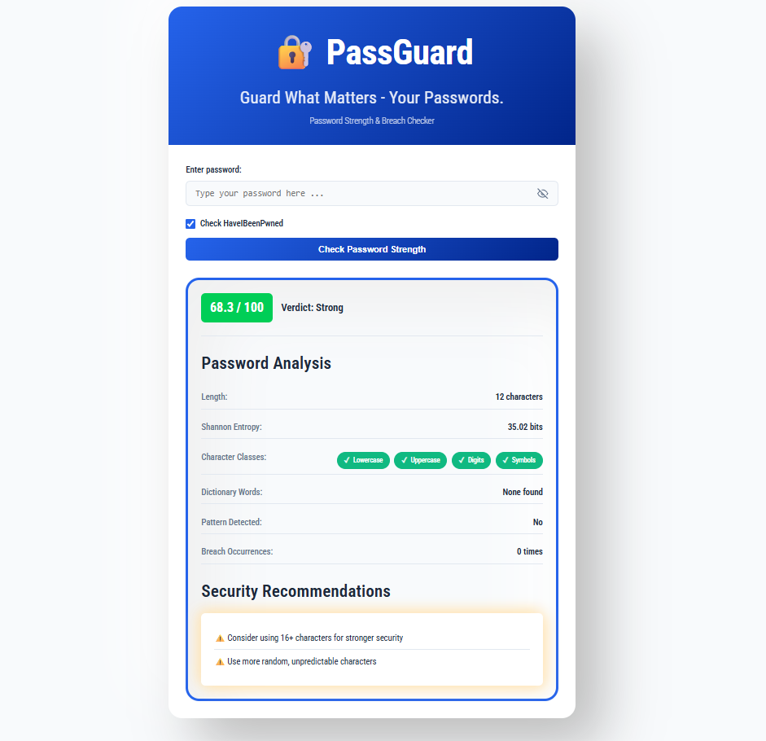

# 🔐 PassGuard - Password Security Analyzer

*A Comprehensive Web Application for Password Strength Analysis and Breach Detection*


## 📖 Abstract

PassGuard is an advanced web application designed to address critical cybersecurity challenges in password security. It provides real-time password strength evaluation, detailed security metrics, and actionable improvement recommendations through an intuitive interface. By combining multi-layered analysis with breach database verification, PassGuard revolutionizes traditional password strength assessment and promotes better security practices.

## ✨ Features

### 🔍 Comprehensive Password Analysis
- **Entropy Calculation**: Shannon entropy measurement for randomness assessment
- **Character Class Analysis**: Detection of uppercase, lowercase, digits, and symbols
- **Pattern Detection**: Identification of common weak patterns and sequences
- **Dictionary Checking**: Detection of dictionary words and common passwords

### 🌐 Real-World Security
- **HIBP Integration**: Secure checking against HaveIBeenPwned breach database
- **Actionable Recommendations**: Specific, context-aware improvement suggestions

### 🎯 User-Centric Design
- **Responsive Interface**: Works seamlessly on desktop and mobile devices
- **Real-time Feedback**: Immediate analysis with detailed breakdown
- **Educational Focus**: Transparent scoring and security explanations
- **Privacy First**: Passwords never stored or logged

## 🏗️ System Architecture

### Core Modules
1. **User Interface Module** - Responsive web interface with real-time validation
2. **Application Logic Module** - Flask-based request handling and orchestration
3. **Password Analysis Module** - Core security engine with comprehensive evaluation
4. **HIBP API Client Module** - Secure breach database integration

### Technical Stack
- **Backend**: Python 3.7+, Flask 2.0+
- **Frontend**: HTML5, CSS3, JavaScript
- **Security**: HIBP API integration
- **Dependencies**: Requests library for API communication

## 🚀 Installation & Setup

### Prerequisites
- Python 3.7 or higher
- pip (Python package manager)

### Quick Start

1. Clone the repository
    ```
    git clone https://github.com/Mxnn2309/passguard.git
    cd passguard
    ```
2. Install dependencies
    ```
    pip install -r requirements.txt
    ```
3. Run the application
    ```
    python app.py
    ```

## 💻 User Interface


